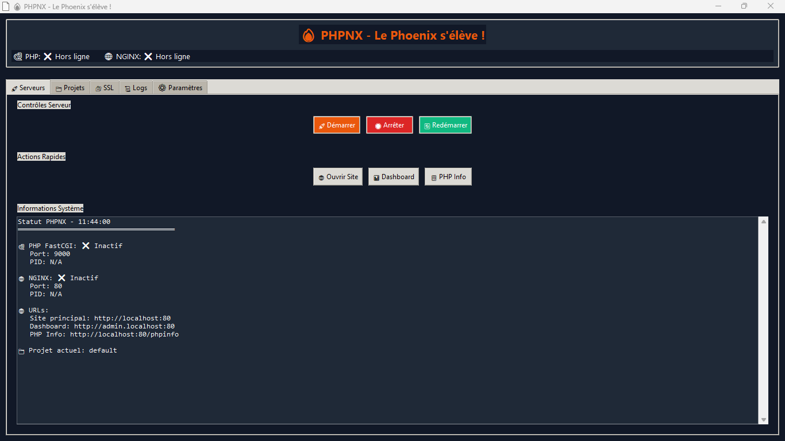

<h1 align="center">🔥 PHPNX - La Suite de Développement PHP Ultime !</h1>

<p align="center">
    
    
    
    
    
</p>
<p align="center"><i>Une suite de développement PHP locale, complète et multi-plateforme. Alimentée par la puissance du Phoenix. 🐦‍🔥</i></p>

---

## ✨ Pourquoi PHPNX ?

> Bien plus qu'un simple launcher, PHPNX est une **suite de développement complète** qui transforme votre machine en un environnement PHP productif et polyvalent. Fini les configurations complexes et les outils disparates. PHPNX centralise tout ce dont vous avez besoin, que vous soyez un développeur débutant ou un expert chevronné.

PHPNX est un environnement **portable, automatisé et puissant** basé sur **NGINX + PHP + Python** qui offre :
-   Une **interface graphique (GUI)** pour une gestion simplifiée.
-   Un **CLI amélioré** pour les adeptes de la ligne de commande.
-   Le support **multi-projets** et la configuration dynamique.
-   L'intégration **Docker** pour une portabilité et une isolation parfaites.
-   Un **système de plugins** pour étendre ses fonctionnalités à l'infini.

---

## 🚀 Fonctionnalités Principales

| Feature                 | Description                                                                                             | Statut |
| ----------------------- | ------------------------------------------------------------------------------------------------------- | :----: |
| 🧭 **Interface Graphique** | Une GUI `tkinter` complète pour gérer les serveurs, les projets, SSL, et les logs.                     |   ✅   |
| 💻 **CLI Amélioré**         | Un menu interactif puissant pour tout contrôler depuis votre terminal.                                  |   ✅   |
| 🐳 **Intégration Docker**   | Lancez l'environnement complet dans un conteneur Docker avec `docker-compose`.                          |   ✅   |
| 📂 **Multi-Projets**        | Gérez plusieurs projets simultanément avec des domaines et des configurations NGINX dédiés.             |   ✅   |
| 🔌 **Système de Plugins**   | Étendez PHPNX avec des plugins personnalisés. Un plugin de backup est déjà inclus !                    |   ✅   |
| 🔐 **Gestion SSL Facile**   | Générez des certificats SSL locaux en un clic pour développer en `https://localhost`.                   |   ✅   |
| 📊 **Web Dashboard**        | Un tableau de bord web pour visualiser l'état des serveurs et les statistiques.                         |   ✅   |
| 💾 **Système de Sauvegarde**  | Créez des archives `.zip` de vos projets directement depuis le CLI ou la GUI.                           |   ✅   |
| 跨 **Support Multi-Plateforme** | Fonctionne sur Windows (portable) et sur Linux/macOS (via Docker ou scripts natifs).                |   ✅   |
| ⚡ **Portable & Isolé**      | Fonctionne sans installation globale et peut être lancé depuis une clé USB (sur Windows).               |   ✅   |

---

## 📸 Aperçu

<p align="center">
  <strong>Interface Graphique (GUI)</strong><br>
  
</p>
<p align="center">
  <strong>Web Dashboard</strong><br>
  <em>[Placeholder for new Web Dashboard screenshot]</em>
</p>

---

## 🛠️ Démarrage Rapide

Choisissez votre méthode de lancement préférée :

### 1. Avec l'Interface Graphique (Recommandé)

La manière la plus simple de démarrer.

1.  Assurez-vous que Python 3.8+ est installé.
2.  Installez les dépendances : `pip install -r requirements.txt`
3.  Lancez la GUI :
    ```bash
    python gui/phpnx_gui.py
    ```
4.  Utilisez les boutons pour démarrer, arrêter et gérer vos serveurs.

### 2. Avec le CLI Amélioré

Pour ceux qui préfèrent la ligne de commande.

1.  Assurez-vous que Python 3.8+ est installé.
2.  Installez les dépendances : `pip install -r requirements.txt`
3.  Lancez le script en mode interactif :
    ```bash
    python phpnx_enhanced.py
    ```
4.  Ou utilisez les commandes directes :
    ```bash
    python phpnx_enhanced.py start
    python phpnx_enhanced.py stop
    python phpnx_enhanced.py status
    ```

### 3. Avec Docker (Multi-plateforme)

La méthode la plus robuste et isolée, idéale pour Linux et macOS.

1.  Assurez-vous que Docker et Docker Compose sont installés.
2.  Lancez l'environnement en arrière-plan :
    ```bash
    docker-compose up -d
    ```
3.  Votre serveur est prêt sur [http://localhost](http://localhost).
4.  Pour arrêter : `docker-compose down`

---

## 🧱 Structure du Projet

```bash
phpnx/
├── app/                    # Projet PHP par défaut
├── config/                 # Fichiers de configuration (settings.json, projects.json)
├── cross_platform/         # Scripts pour environnements non-Windows
├── docker/                 # Fichiers Docker (Dockerfile, docker-compose.yml)
├── gui/                    # Interface graphique (tkinter)
├── logs/                   # Fichiers de log (phpnx.log, nginx.log, etc.)
├── plugins/                # Plugins pour étendre les fonctionnalités
├── projects/               # Dossier pour les projets supplémentaires (mode multi-projets)
├── ssl/                    # Certificats SSL générés
├── static/                 # Fichiers statiques (CSS, JS, dashboard)
├── phpnx.py                # Script de base (legacy)
├── phpnx_enhanced.py       # CLI amélioré avec toutes les fonctionnalités
├── phpnx_websocket.py      # Serveur WebSocket pour le dashboard
├── requirements.txt        # Dépendances Python
└── README.md               # Cette documentation
```

---

## 🗺️ Feuille de Route

Le Phoenix ne s'arrête jamais de renaître. Voici les prochaines évolutions prévues :

-   [ ] **Finalisation du support natif pour Linux/macOS** en dehors de Docker.
-   [ ] **Gestionnaire de versions PHP** pour switcher facilement entre les versions.
-   [ ] **Intégration d'un terminal web** dans le dashboard.
-   [ ] **Création d'un installeur `exe` et `dmg`** pour une distribution encore plus simple.
-   [ ] **Mise à jour automatique** de PHPNX via GitHub.
-   [ ] **Enrichissement du catalogue de plugins** (ex: Xdebug, MailHog, etc.).

---

## 🤝 Contribuer

Le projet est plus vivant que jamais et les contributions sont les bienvenues ! Que vous soyez développeur, designer, ou testeur, votre aide est précieuse.

1.  🍴 Fork ce repo
2.  🚀 Clone ton fork
3.  💻 Crée une branche (`git checkout -b feature/mon-idee`)
4.  🔥 Codez avec passion
5.  ✅ Pushez vos changements (`git push origin feature/mon-idee`)
6.  📩 Créez une Pull Request

## 🧙‍♂️ Auteur

> Kei Prince Frejuste
> 💼 Web & Software Developer
> 📫 frejuste.dev56@gmail.com
> 🌐 [Portfolio](https://portfolio-edumanagers-projects.vercel.app/) | [GitHub](https://github.com/Frejuste-dev)

---

## 📝 Licence
Ce projet est distribué sous licence MIT.
Fais-en bon usage, mais surtout… fais-le vivre.

> “Comme le Phoenix, tout projet peut renaître de ses cendres. Il suffit d’un peu de code, d’un peu de feu, et d’une grande vision.”
